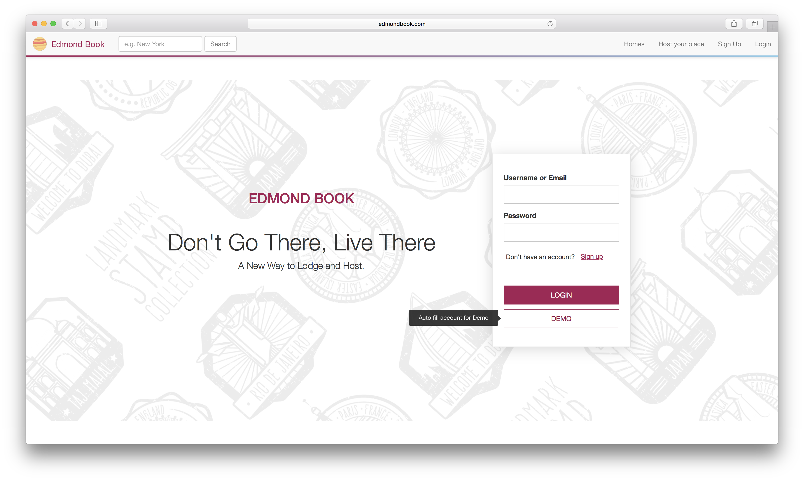
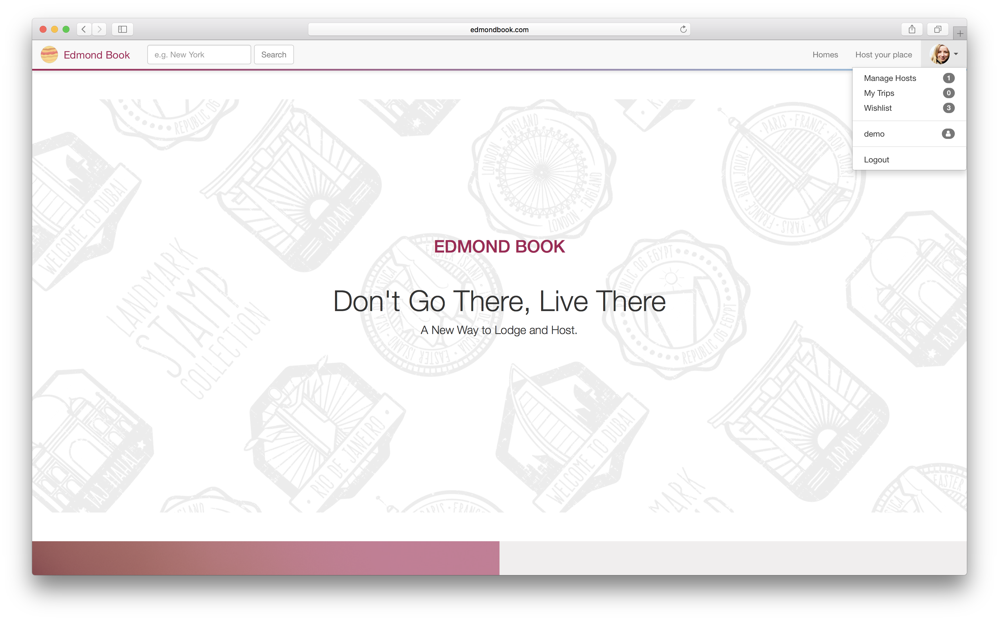
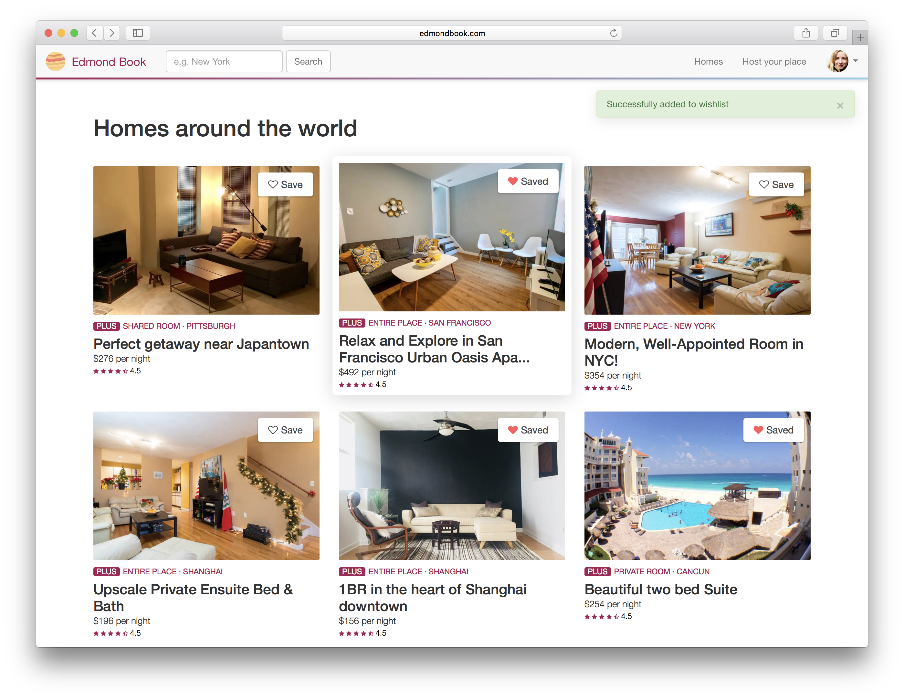
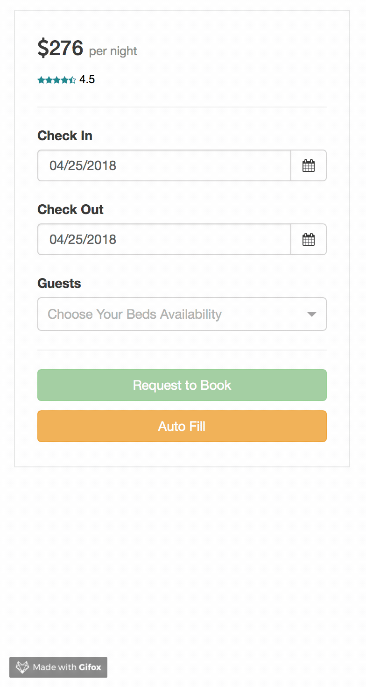
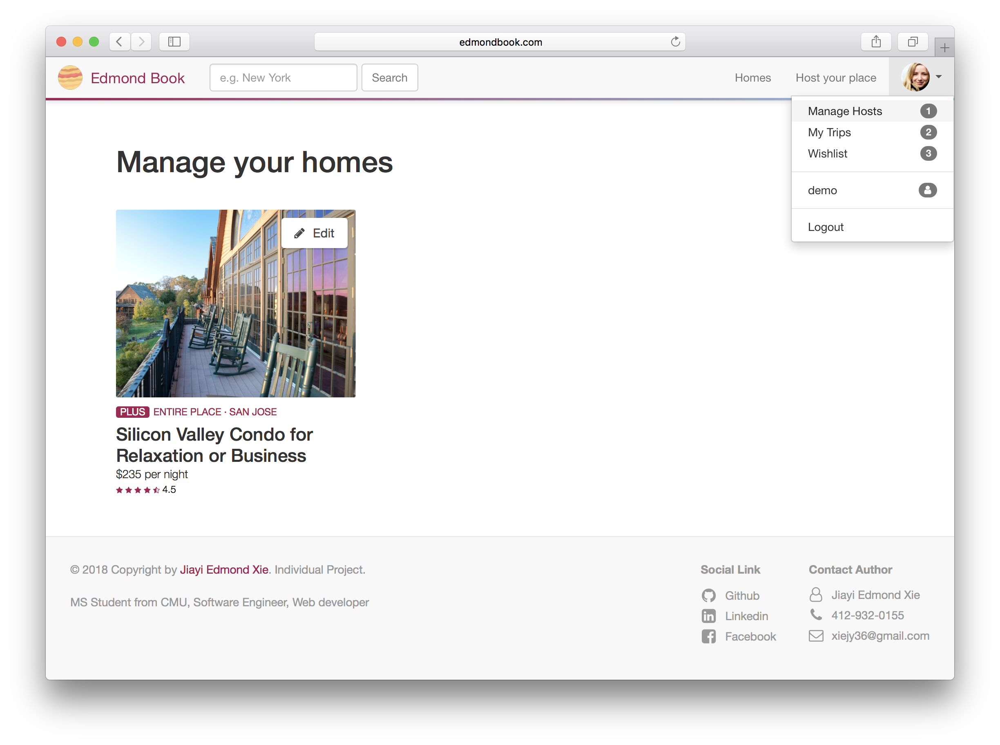
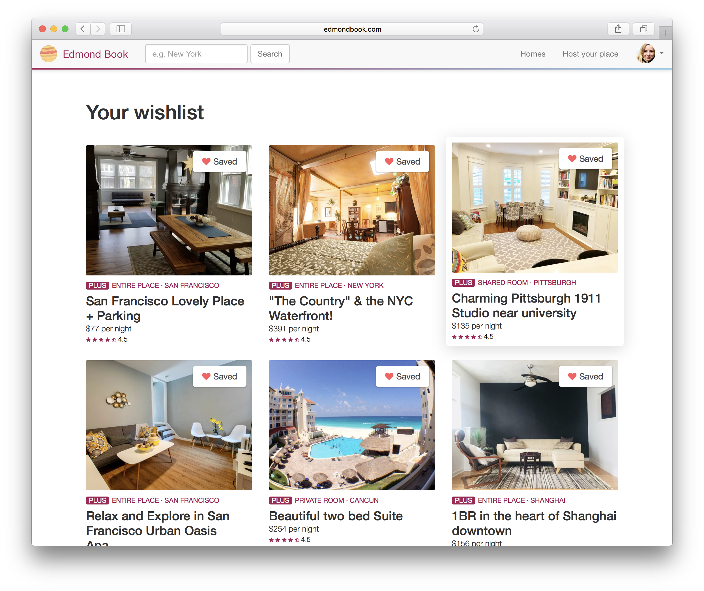
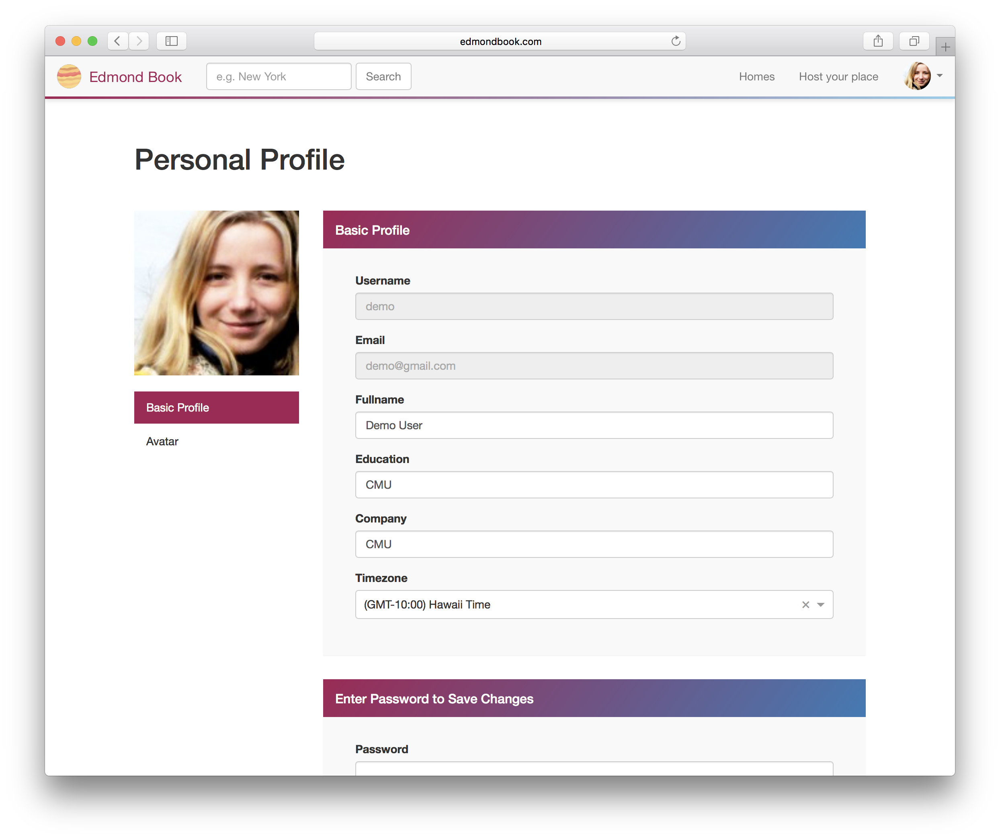

# Edmondbook

Live: [http://www.edmondbook.com](http://www.edmondbook.com) (Domain name expired)

Live: [https://edmondhome.herokuapp.com](https://edmondhome.herokuapp.com)

Edmondbook is a web application inspired by Airbnb.

### Backend

The backend is written with Node.js, Express and PostgreSQL database.

### Frontend

The frontend skeleton is written in React/Redux.

### Design

Sass is used to implement the style designing across the website.

### Tech Stack Links

* [Node.js](https://nodejs.org/en/)
* [Express](https://expressjs.com/)
* [React](https://reactjs.org/)
* [Redux](https://redux.js.org/)
* [Sass](https://sass-lang.com/)
* [Webpack](https://webpack.js.org/)
* [Knex.js](http://knexjs.org/)
* [Bookshelf.js](http://bookshelfjs.org/)

## Features & Implementation

On the homepage, from the navigation bar on the top, user can sign up or sign in account. A **"Demo"** account is provided. The logo on the top left can always redirect the user back to the homepage. The **"Homes"** button will lead users to browse all the homes which they can book. The **"Host your place"** button will lead users to the page where they can host their own homes.



After signed in, the **"Sign Up"** and **"Login"** buttons will change to a badge which is the avatar of the user. The badge has a dropdown list including **"Manage Host"**, **"My Trips"**, **"Wishlist"**, **"Edit User Profile"**, **"Log Out"** options with respective functions.

The website takes username or email address as unique identifier. Either one can be accpected for login. The password verification is done in encryption, no password will be saved in the database.



### Homes

This page will show all the events from the database, supported with a search function. User can easily find a specific home typing keywords, (e.g. New York City). the keyword is case insensitive. On the right top corner of the home gallery card, there is a **"Favorite"** button. By clicking it you can put any home into your wishlist.



All the detail information of each home is shown on the individual home detail page. The information includes the home image, title, location, property type, host information, amenities, and so on.


User can book a place by chooing the check in date and check out date on the booking panel to the right. A **"Auto Fill"** button for demo is provided.

<div style="text-align:center">

</div>

User can also host their own place with all the required information, such as location, price, description, and so on. The uploaded pictures will be stored with a url from cloudinary, which can provided customized size of image, improving the image loading performance in different pages. User can enter this page by clicking "Host your place" button on the navigation bar.


### Manage hosts

In the **"Manage Hosts"** page, users can manage the homes which they posted, including editing and deleting. By clicking the "Edit" button on the top right corner of the gallery card can enter the edit page.



### Trips

In the **"Trips"** page, users can check the reservations which they booked.


### Wishlist

In the **"Wishlist"** page, users can check the homes which are saved in their favorite list.



### Profile

In the **"Profile"** page, users can edit their profile and upload their avatars.



## Database

### Table Schema

```javascript
// USERS
exports.up = function(knex, Promise) {
  return knex.schema.createTable("users", table => {
    table.increments();
    table
      .string("email")
      .notNullable()
      .unique();
    table
      .string("username")
      .notNullable()
      .unique();
    table.string("timezone").notNullable();
    table.string("password_digest").notNullable();
    table.string("fullname");
    table.string("education");
    table.string("company");
    table.string("avatar");
    table.string("phone");
    table.timestamps();
  });
};

// HOMES
exports.up = function(knex, Promise) {
  return knex.schema.createTable("homes", table => {
    table.increments();
    table.string("title").notNullable();
    table.text("description").notNullable();
    table.string("image").notNullable();
    table.string("price").notNullable();
    table.string("service_fee").notNullable();
    table.string("district").notNullable();
    table.string("address").notNullable();
    table.string("property_type").notNullable();
    table.string("room_type").notNullable();
    table.string("setup_for_guest").notNullable();
    table.string("guest_availability").notNullable();
    table.string("rooms_availability").notNullable();
    table.string("beds_availability").notNullable();
    table.string("bath_availability").notNullable();
    table.string("target").notNullable();
    table.text("amenities");
    table.text("otherAmenities");
    table.timestamps();
    table
      .integer("host_id")
      .notNullable()
      .references("id")
      .inTable("users")
      .onDelete("CASCADE")
      .index();
  });
};

// TRIPS
exports.up = function(knex, Promise) {
  return knex.schema.createTable("trips", table => {
    table.increments();
    table.string("order_id").notNullable();
    table.string("check_in_time").notNullable();
    table.string("check_out_time").notNullable();
    table.string("reserved_guests").notNullable();
    table.text("prices").notNullable();
    table.text("dates");

    table.timestamps();
    table
      .integer("home_id")
      .notNullable()
      .references("id")
      .inTable("homes")
      .onDelete("CASCADE")
      .index();
    table
      .integer("guest_id")
      .notNullable()
      .references("id")
      .inTable("users")
      .onDelete("CASCADE")
      .index();
  });
};

// WISHLIST
exports.up = function(knex, Promise) {
  return knex.schema.createTable("wishlist", table => {
    table.increments();
    table.timestamps();
    table
      .integer("home_id")
      .notNullable()
      .references("id")
      .inTable("homes")
      .onDelete("CASCADE")
      .index();
    table
      .integer("keeper_id")
      .notNullable()
      .references("id")
      .inTable("users")
      .onDelete("CASCADE")
      .index();
  });
};
```

## Homepage Design

CSS on its own can be fun, but stylesheets are getting larger, more complex, and harder to maintain. This is where a preprocessor can help. **Sass** lets you use features that don't exist in CSS yet like variables, nesting, mixins, inheritance and other nifty goodies that make writing CSS fun again.

<div style="text-align:center">

</div>

### Sass Code Example

```css
.home-page-base {
  .welcome {
    padding: 160px 50px;
    margin-top: 50px;
    margin-bottom: 50px;
    position: relative;
    overflow: hidden;

    @media only screen and (max-width: 991px) {
      padding: 0px 50px 20px 50px;
    }

    .background-wrapper {
      position: absolute;
      height: 800px;
      width: 100%;
      top: 0;
      left: 0;
      background-image: url("http://res.cloudinary.com/dqace5qmb/image/upload/c_scale,w_2522/v1524230091/travel-background.png");
      -webkit-filter: grayscale(100%); /* Safari 6.0 - 9.0 */
      filter: grayscale(100%);
      opacity: 0.1;

      background-size: cover;
    }

    .slogan {
      align-items: center;
      justify-content: center;
      padding-right: 60px;

      &.isAuthenticated {
        padding-right: 15px;
        height: 400px;
      }

      @media only screen and (max-width: 991px) {
        padding-right: 0;
        padding-left: 0;
        margin-bottom: 50px;

        &.isAuthenticated {
          margin-bottom: 50px;
          padding-right: 0;
          height: auto;
        }
      }

      h2 {
        text-align: center;
        color: var(--color-primary);
        text-transform: uppercase;
        margin-top: 80px;
        margin-bottom: 50px;
      }

      h1 {
        text-align: center;
        font-size: 50px;
        font-weight: 300;
      }

      p {
        text-align: center;
        font-size: 20px;
        font-weight: 300;
      }
    }
    ...
```


